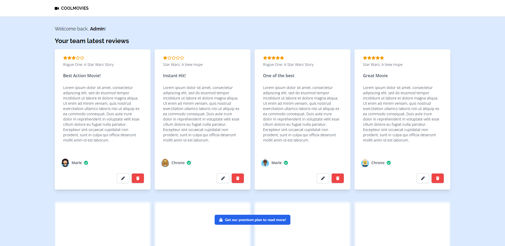
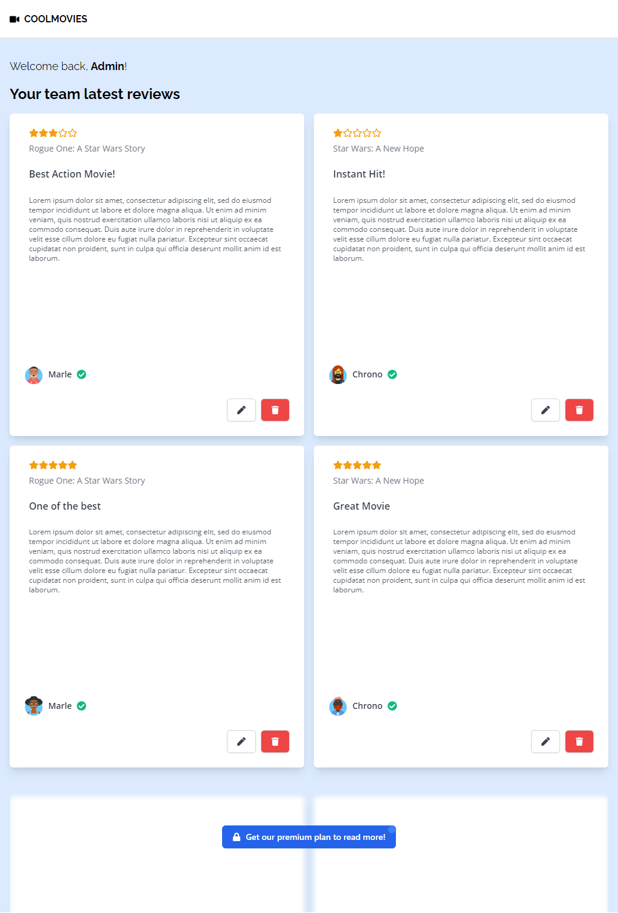
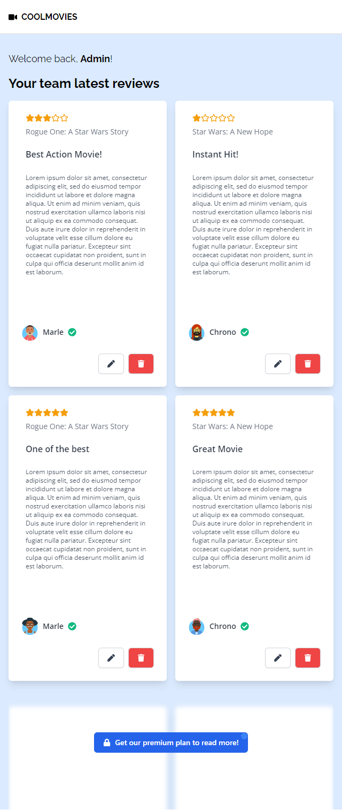
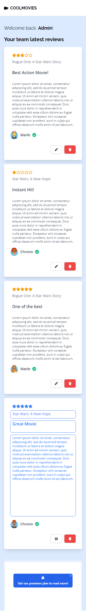

# Coolmovies (Frontend) - Thiago Coutinho

This project was bootstrapped with [Create React App](https://github.com/facebook/create-react-app).

Used node version: **v14.17.6**
## Available Scripts

In the project directory, you can run:

### `yarn start`

Runs the app in the development mode.\
Open [http://localhost:3000](http://localhost:3000) to view it in the browser.

## Screenshots

### Lg desktop

### Sm desktop

### Tablet

### Mobile

